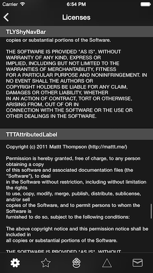

# SUBLicenseViewController

Incredibly simple license view controller for iOS. Makes it really easy to attractively present acknowledgements for open source libraries within your app. You know, the ones that come with all that 3rd party code you use? Currently supports Cocoapods as well as manual entry. Under development (a part of the Submarine project, currently closed-source).

 

## Usage

    SUBLicenseViewController *licenseViewController = [[SUBLicenseViewController alloc] init];
    [licenseViewController addLicenseWithTitle:@"Noun Project" body:@"Roman J. Sokolov, Pencil (42830)\nVicons Design, Person (78759 & 78763)\nNicholas Menghini, Light Bulb (10784)\nHenry Ryder, Diving Helmet (120651)\nIcomatic, Collapse (18936)"];
    [self.navigationController pushViewController:licenseViewController animated:YES];

## Installation

SUBLicenseViewController **will be available** through [CocoaPods](http://cocoapods.org). To install
it, simply add the following line to your Podfile:

    pod "SUBLicenseViewController"

## Author

[Julian (insanj) Weiss](https://twitter.com/insanj), [insanjmail@gmail.com](mailto:insanjmail@gmail.com)

## License

	SUBLicenseViewController: Incredibly simple license view controller for iOS.
	Copyright (C) 2015 Julian (insanj) Weiss
	
    This program is free software: you can redistribute it and/or modify
    it under the terms of the GNU General Public License as published by
    the Free Software Foundation, either version 3 of the License, or
    (at your option) any later version.

    This program is distributed in the hope that it will be useful,
    but WITHOUT ANY WARRANTY; without even the implied warranty of
    MERCHANTABILITY or FITNESS FOR A PARTICULAR PURPOSE.  See the
    GNU General Public License for more details.

    You should have received a copy of the GNU General Public License
    along with this program.  If not, see <http://www.gnu.org/licenses/>.
    