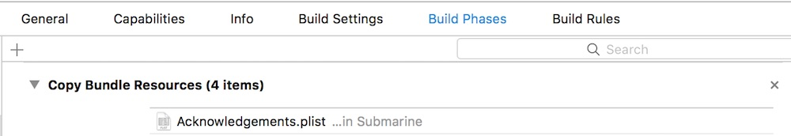

# SUBLicenseViewController

[](https://travis-ci.org/insanj/SUBLicenseViewController)
[](http://cocoapods.org/pods/SUBLicenseViewController)
[](http://cocoapods.org/pods/SUBLicenseViewController)
[](http://cocoapods.org/pods/SUBLicenseViewController)

Incredibly simple license view controller for iOS. **Makes it really easy to attractively present acknowledgements for open source libraries within your app.** You know, the ones that come with all that 3rd party code you use?

 

## Usage

    SUBLicenseViewController *licenseViewController = [[SUBLicenseViewController alloc] init];
    [self.navigationController pushViewController:licenseViewController animated:YES];

SUBLicenseViewController will automatically parse and add your [Cocoapods acknowledgements files](https://github.com/CocoaPods/CocoaPods/wiki/Acknowledgements) as long as you add it to `Copy Bundle Resources` like so:



To run the example project, clone the repo, and run `pod install` from the Example directory first.

## Requirements

## Installation

SUBLicenseViewController is available through [CocoaPods](http://cocoapods.org). To install
it, simply add the following line to your Podfile:

```ruby
pod "SUBLicenseViewController"
```

## Author

Julian (insanj) Weiss, insanjmail@gmail.com

## License

SUBLicenseViewController is available under the MIT license. See the LICENSE file for more info.
